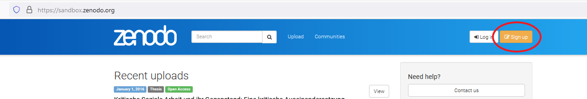
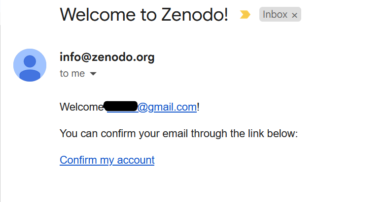
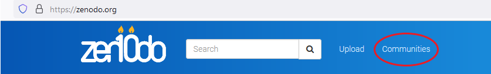
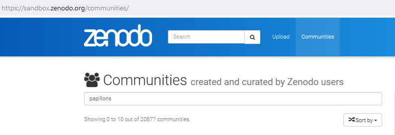
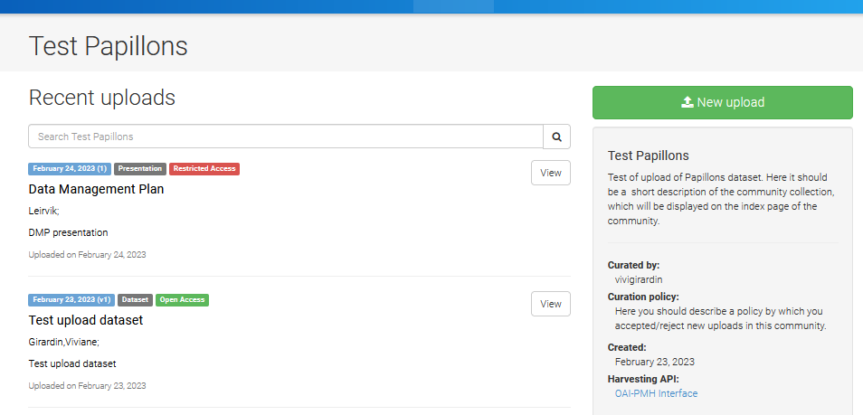
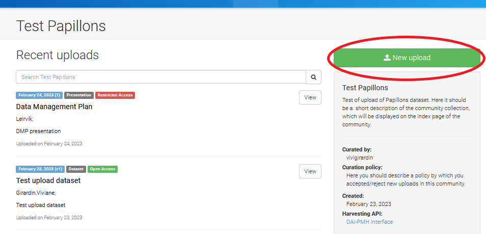
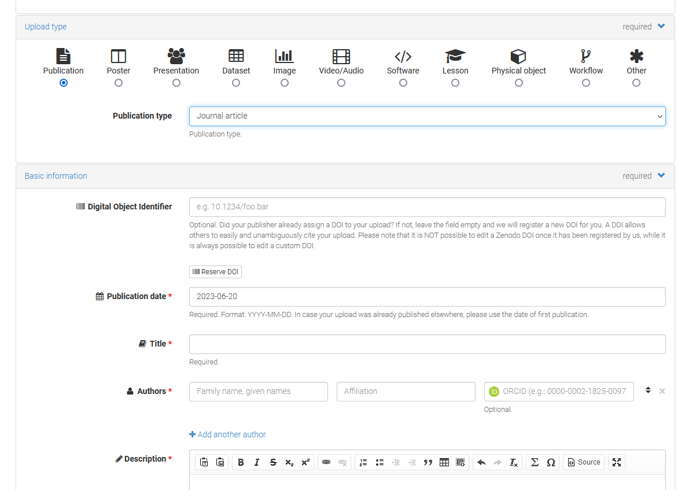
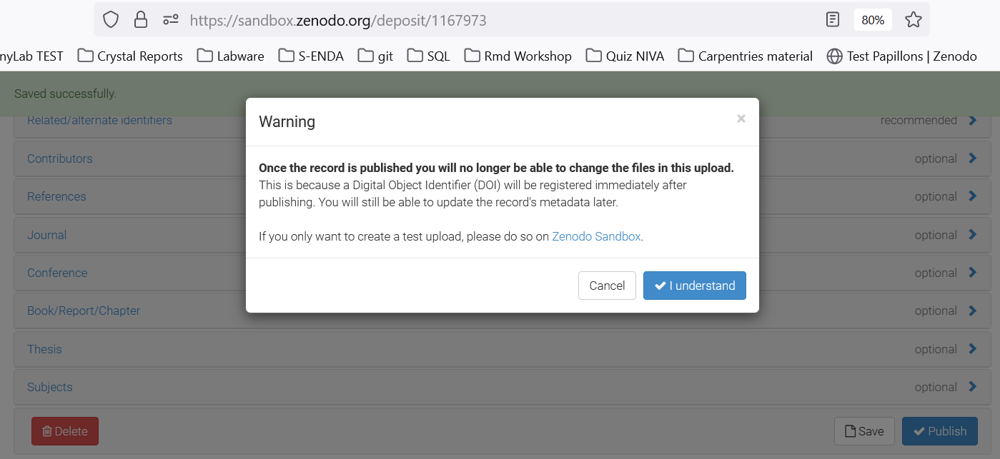

## About

_These are instructions for the test environment_ 

[Zenodo](https://about.zenodo.org/) is an open-source repository for scientific outputs. Zenodo enables linking research outputs to datasets and funding information. All uploads get a Digital Object Identifier (DOI), and all data are stored at the European Organization for Nuclear Research  [(CERN)](https://www.home.cern/).

This brief how-to will describe how to search for and upload data to Zenodo via its test environment. This environment is an exact copy of Zenodo, but here you will have the ability to test the tool before uploading data to the actual Papillons community (coming soon).

## Sign up/ Log in to Zenodo

|  |  |  
| :------- | :----------- |
|   1. Click on _Sign Up_ on the top-left corner of the site. If you already have an account you can skip to [the next step](#jump)     |
|   2. You can sign up by creating an username and password, or using an [ORCID](https://orcid.org/) or [GitHub](https://github.com/) account.|{width=500px}|
|3.After signing up must open your e-mail inbox and confirm your e-mail by clicking on a link|  |        

## Find Papillons community

| | |
| :------- | :----------- |
1. Go to [sandbox.zenodo.org](https://sandbox.zenodo.org/) and click on _Communities_ on the banner on the top of the page| |

| | |
| :------- | :----------- |
2. On the Communities search field search for _Papillons_ and press enter (note that you will not find the community by using the general search field)| |

| | |
| :------- | :----------- |
3. You will find the _Test Papillons_ below. Click on _View_| {width=400px}|

| | |
| :------- | :----------- |
4. All uploaded files have tags identifying date uploaded, type of file, and type of access|{width=500px}

**Description of tags:**

- Uploaded date: Month,DD,YYY(version)
- Type of file: Dataset; Presentation; Poster, etc 
- Type of access:
    - Open Access 
    - Embargoed Access - The file will be given open access after a date specified by the person who uploaded de file (this person can also edit the date. More later) 
    - Restricted Access - Access can be requested. Conditions for access can be given by the publisher.
    - Closed Access - Files are not publicly accessible.          

## Uploading files

| | |
| :------- | :----------- |
|1. Click on New upload |
2. Upload the file by either drag and drop or by clicking on the Choose files, followed by Start upload||
3. Some fields are required such as upload and license type, and basic information. It is also possible to add additional information such as contributors, alternative identifiers, references, funding, journal, etc.| |
|4. When you click on Publish, you will receive a warning recommending to use Zenodo Sandbox if you wish to just test upload, even when you are already in the sandbox. Just click on I understand. A DOI number will be automatically created.| |
|5. Your upload will be searchable on Zenodo, but not yet connected to the community Papillons (Test Papillons in this case). A curator will receive your upload request and accept or decline it. The rules for Embargoed Access, Restricted Access, and Closed Access also apply for curators. That means that they can only access open files. 
5. You can find all your uploads (including drafts) by clicking on _Upload_ On the top banner| 

## Useful links

- [Make Your Code Citable Using GitHub and Zenodo: A How-to Guide](https://genr.eu/wp/cite/)

