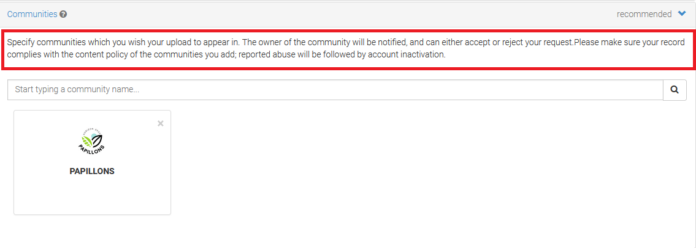

## About

_The online version of this document can be found [here](https://nivanorge.github.io/Papillons/)_

[Zenodo](https://about.zenodo.org/) is an open-source repository used to archive and share any research data. A Digital Object Identifier (DOI) is assigned for any file submitted, and all data are stored at the European Organization for Nuclear Research  [(CERN)](https://www.home.cern/).

This document intends to describe and provide what is needed for searching and uploading data Papillons community in Zenodo. 

## Sign up/ Log in to Zenodo

|  |  |  
| :------- | :----------- |
|   1. Go to [zenodo.org](https://zenodo.org/) and click on _Sign Up_ on the top-left corner of the site. If you already have an account you can jump to [the next step](#jump).     | 
|   2. You can sign up by creating an username and password, or using an [ORCID](https://orcid.org/) or [GitHub](https://github.com/) account.|{width=500px}|
|3. After signing up you must open your e-mail inbox and confirm your e-mail by clicking on a confirmation link.|  |        

 

## Find Papillons community

| | |
| :------- | :----------- |
1.  Click on _Communities_ on the banner on the top of the page.| |

| | |
| :------- | :----------- |
2. On the Communities search field search for _Papillons_ and press enter (note that you will not find the community by using the general search field).| |

| | |
| :------- | :----------- |
3. You will find the _Test Papillons_ below. Click on _View_.| {width=400px}|

| | |
| :------- | :----------- |
4. All uploaded files have tags identifying date uploaded, type of file, and type of access.|{width=500px}|

**Description of tags:**

- Uploaded date: Month,DD,YYY(version)
- Type of file: Dataset; Presentation; Poster, etc 
- Type of access:
    - Open Access 
    - Embargoed Access - The file will be given open access from a date specified by the publisher (the date can be changed after upload).
    - Restricted Access - Access can be requested. Conditions for access can be given by the publisher.
    - Closed Access - Files are not publicly accessible.          

## Uploading files

| | |
| :------- | :----------- |
|1. Click on New upload |
2. Upload the file by either drag and drop or by clicking on Choose files, followed by Start upload||
3. Some fields are required such as license and upload type, and basic information. It is also possible to upload additional information such as contributors, alternative identifiers, references, funding, journal, etc.||
4. For publication upload it is important to choose the publication type.| |
5. Your upload will be searchable on Zenodo, but not yet connected to the Papillons community. A curator (community owner) will receive your request to include your file in the community repository and approve it if the community requirements are fulfilled (if any). The rules for Embargoed Access, Restricted Access, and Closed Access also apply for curators. That means that they can only access open access files.|| 
6. You can find all your uploads (including drafts) by clicking on _Upload_ On the top banner.| |

## Useful links

- [About Zenodo](https://about.zenodo.org/)
- [Link to an OAI-PMH feed, which can be used by other digital repositories to harvest this community.](https://sandbox.zenodo.org/oai2d?verb=ListRecords&set=user-papillons-test&metadataPrefix=oai_dc)
- [Make Your Code Citable Using GitHub and Zenodo: A How-to Guide](https://genr.eu/wp/cite/)

 

