## About

[Zenodo](https://about.zenodo.org/) is an open-source repository used to archive and share any research data. A Digital Object Identifier (DOI) is assigned to any file submitted, and all data are stored at the European Organization for Nuclear Research  [(CERN)](https://www.home.cern/).

## Sign up/ Log in to Zenodo

|  |  |  
| :------- | :----------- |
|   1. Go to [zenodo.org](https://zenodo.org/) and click on _Sign Up_ on the top-left corner of the site.You can jump to [the next step](#jump) if you already have an account.     |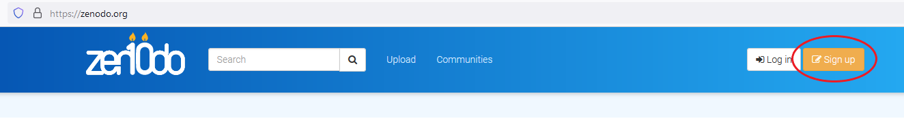 
|   2. You can sign up by creating an username and password, or using an [ORCID](https://orcid.org/) or [GitHub](https://github.com/) account.|{width=500px}|
|3. After signing up you must open your e-mail inbox and confirm your e-mail by clicking Confirm my account.| 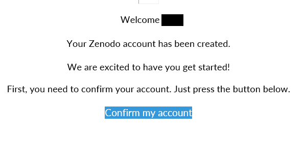 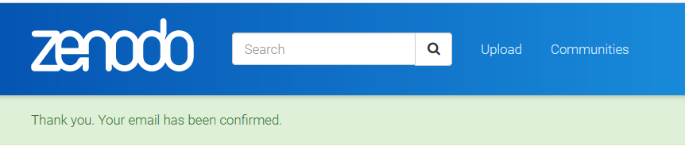|        

 

## Create or find a community

### Create a community
Jump to [_Find a community_](#jumptocommunity)

Communities are shared areas on Zenodo where you can curate and manage your project research outputs. 

Overall, communities in Zenodo can make your data more FAIR by promoting standardized metadata, curated collections, community-specific tagging, open data sharing policies, interoperability standards, and data quality practices. 

| | |
| :------- | :----------- |
1.  Click on the plus icon and select "New community".| 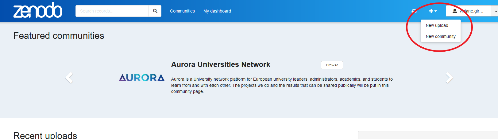|

| | |
| :------- | :----------- |
2.  Enter your community name and identifier. This will be your community's URL identifier, so the simpler, the better.| 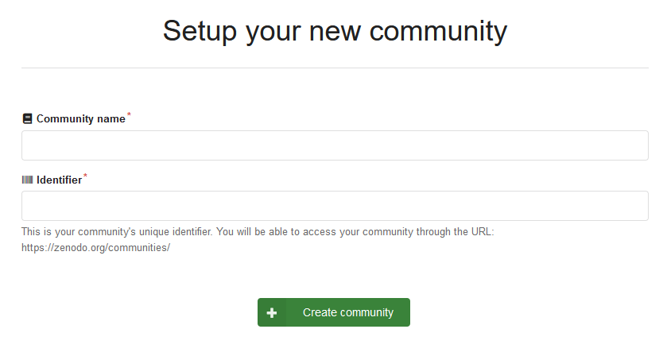|

### Find a community
 

| | |
| :------- | :----------- |
1.  Click on _Communities_ on the banner on the top of the page.| |

| | |
| :------- | :----------- |
2. Search for _Papillons_ **on the _Communities_ search field** and press enter (note that you will not find the community by using the general search field).| 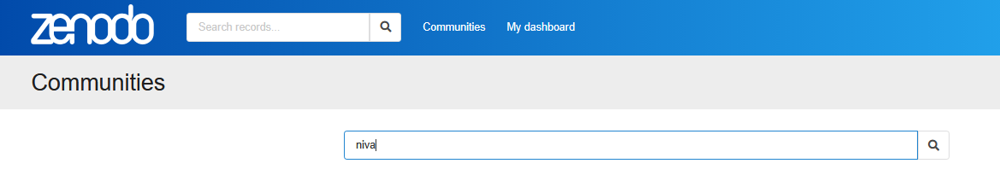|

| | |
| :------- | :----------- |
3. You will find the PAPILLONS community below. Click on the title.| 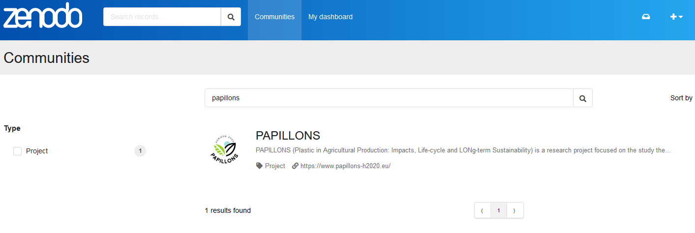{width=500px}|

| | |
| :------- | :----------- |
4. All uploaded files have tags identifying date uploaded, type of file, and type of access.|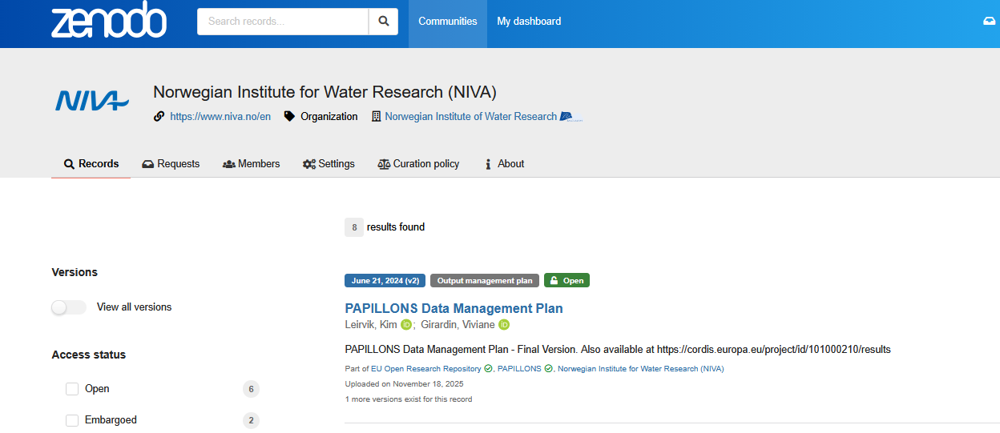{width=500px}|

  

## Uploading files

| | |
| :------- | :----------- |
|- Click on New upload |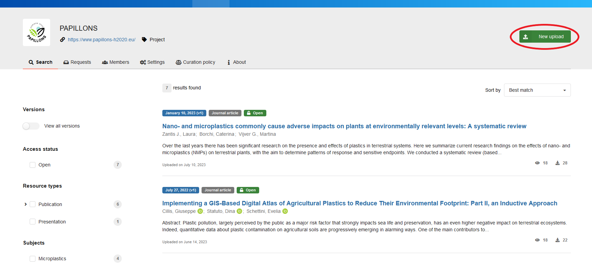|
- Click on Select a community on the top the upload section.| 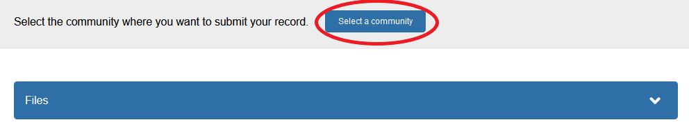|
- Search for PAPILLONS and click on _Select_.| 
- Upload your file(s) by either drag and drop or by clicking on Upload files.|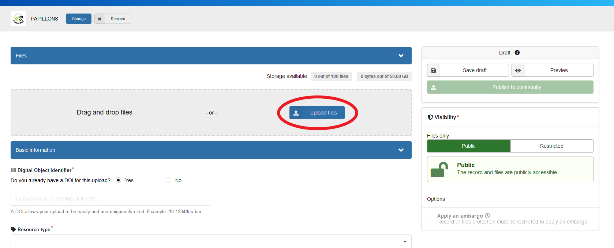|
- Choose the visibility of your upload. If you choose Public, your file will be open source. if you choose Restricted, the files will be only accessible by users specified in the permissions.| 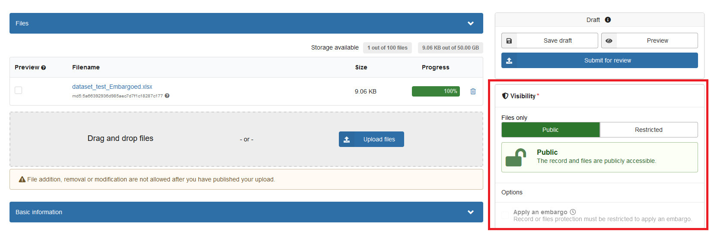|
It is also possible to apply an embargo| 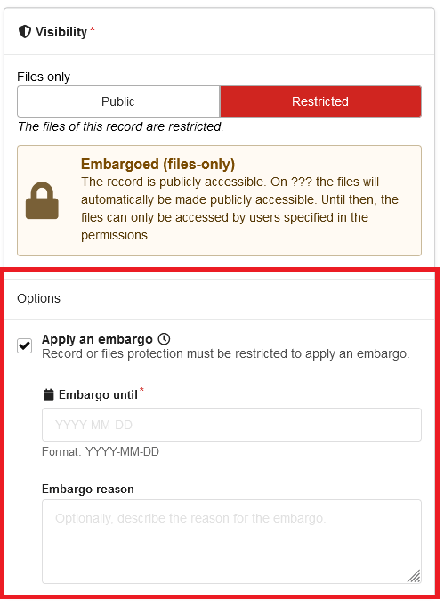|
- Most fields on the _Basic Information_ section are required (marked with *).|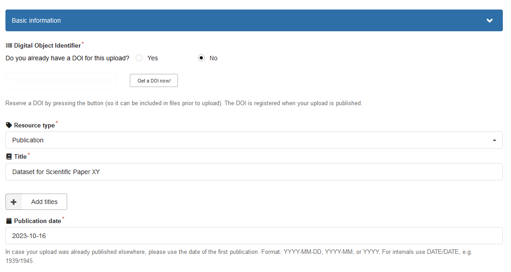|
- Once you are ready to submit, click on Submit for review. It is also possible to save a draft.| |
- Once your upload is completed, it will be searchable on Zenodo, but not yet connected to the Papillons community. A curator (community owner) will receive your request to include your file in the community repository and approve it if the community requirements are fulfilled (if any).||
- You can find all your uploads (including drafts) by clicking on _My dashboard_ on the top banner.|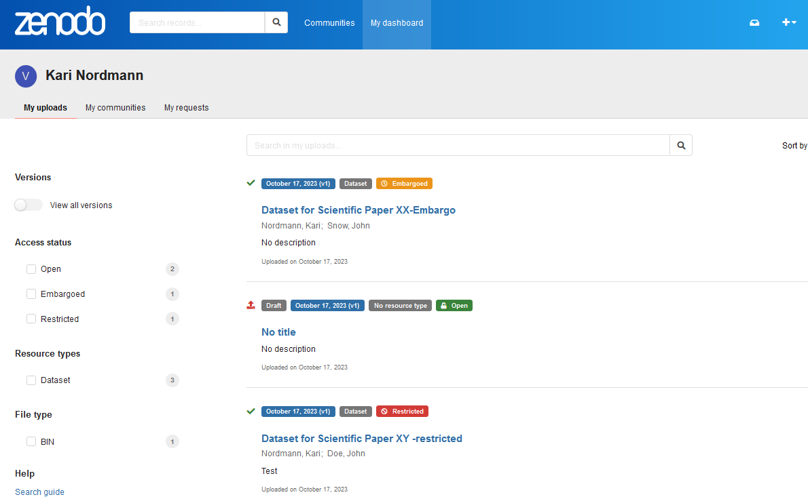|

## Description of tags

 **Uploaded date:**
    - Month,DD,YYY(version)
    
    
 **File types:**  Dataset; Presentation; Poster, etc 
 
These tags describe the type of resource uploaded to Zenodo, such as datasets, publications, software, presentations, etc. They help users filter content based on the type of resource they are looking for.
    
    
**Access types:**

  - Open - Content with open access is freely available to anyone.
  - Embargoed - The file will be given open access from a date specified by the publisher (the date can be changed after upload).
  - Restricted - Access can be requested. Conditions for access can be given by the publisher.
    
 

## Useful links

- [About Zenodo](https://about.zenodo.org/)
- [Zenodo documentation](https://help.zenodo.org/docs/)
- [About communities](https://help.zenodo.org/docs/communities/about-communities/)
- [Frequently Asked Questions](https://help.zenodo.org/faq/)
- [Link to an OAI-PMH feed, which can be used by other digital repositories to harvest this community.](https://sandbox.zenodo.org/oai2d?verb=ListRecords&set=user-papillons-test&metadataPrefix=oai_dc)

 

